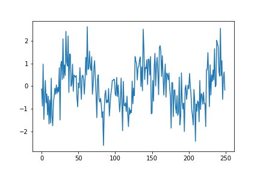

# Tarea-4
Solución Tarea 4 B63761

1) Crear un esquema de modulación BPSK para los bits presentados. Esto implica asignar una forma de onda sinusoidal normalizada (amplitud unitaria) para cada bit y luego una concatenación de todas estas formas de onda.

En la siguiente imagen se observa la forma de onda de la portadora de 5000 Hz.

Con base en la onda sinusoidal vista anteriormente, se procede a realizar el esquema de modulación BPSK para los bit del archivo bits10k.csv, con los cuales se obtiene la siguiente señal modulada  para BPSK.

2) Calcular la potencia promedio de la señal modulada generada.

Se obtiene como potencia promedia 0.4900009800019598 W de la señal modulada generada por BPSK. 

3) Simular un canal ruidoso del tipo AWGN (ruido aditivo blanco gaussiano) con una relación señal a ruido (SNR) desde -2 hasta 3 dB.

Para la simulación del canal ruidoso del tipo AWGN, se utiliza una relación señal a ruido (SNR) desde -7 hasta 3 dB, ya que la modulación BPSK, es muy robusta y se pretende obtener a partir de dicho intervalo cierto grado de error al transmitir bits.

Canal ruidoso para -7 dB

Canal ruidoso para -6 dB

Canal ruidoso para -5 dB

Canal ruidoso para -4 dB

Canal ruidoso para -3 dB

Canal ruidoso para -2 dB

Canal ruidoso para -1 dB

Canal ruidoso para 0 dB

Canal ruidoso para 1 dB

Canal ruidoso para 2 dB

Canal ruidoso para 3 dB

4) Graficar la densidad espectral de potencia de la señal con el método de Welch (SciPy), antes y después del canal ruidoso.

A continuación se muestra la densidad espectral de potencia de la señal antes del canal ruidoso.

Una vez obtenida obtenida la densidad espectral de potencia de la señal antes del canal ruidoso, se porcede a realizar la obtención de la densidad espectral de potencia de la señal después del canal ruidoso, para ello se muestra nada más la gráfica para un SNR de -2 dB.

Finalmente es posible visualizar las restantes densidad espectral de potencia después del canal ruidoso en las imagenes PSD2.png, PSD3.png, PSD4.png, PSD5.png y PSD6.png, cabe señalar que es basicamente la misma densidad de potencia, sin embargo varía levemente la atenuación.

5)  Demodular y decodificar la señal y hacer un conteo de la tasa de error de bits (BER, bit error rate) para cada nivel SNR.

Al demodular y decodificar la señal para un umbral de cero, ya que el producto interno de -sin(x) y sin(x) es cero sin ruido, se obtiene los siguiente:

*tasa de error de bits para -7 dB:  0.0013

*tasa de error de bits para -6 dB:  0.0001

*tasa de error de bits para -5 dB:  0.0

*tasa de error de bits para -4 dB:  0.0

*tasa de error de bits para -3 dB:  0.0

*tasa de error de bits para -2 dB:  0.0

*tasa de error de bits para -1 dB:  0.0

*tasa de error de bits para 0 dB:  0.0

*tasa de error de bits para 1 dB:  0.0

*tasa de error de bits para 2 dB:  0.0

*tasa de error de bits para 3 dB:  0.0

6) Graficar BER versus SNR.

Finalmente se obtiene al realizar el contraste entre BER versus SNR la siguiente curva

